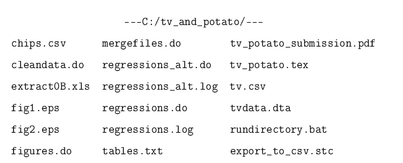
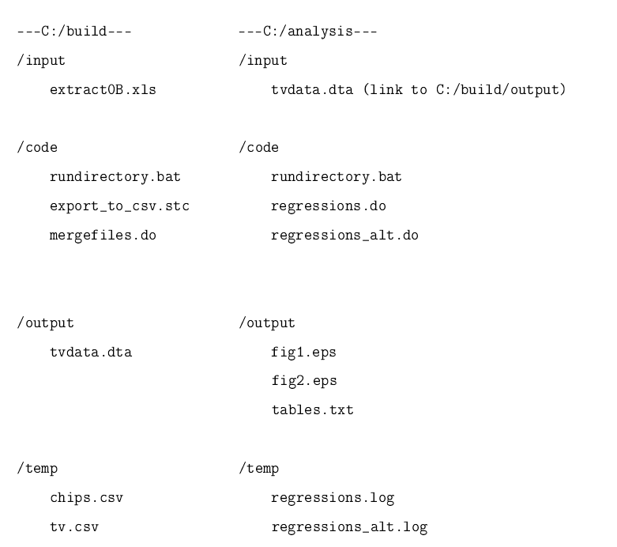

## Hello!
1. Who you are.
2. What you did this summer.
3. What experience, if any, you have with data analysis, programming languages, etc.

---
## What is this course about?
1. Getting
2. Cleaning
3. and Presenting data. 
all within R.

---
## Data Munging/Wrangling 


---
## 
Data scientists, according to interviews and expert estimates, spend from 50 percent to 80 percent of their time mired in this more mundane labor of collecting and preparing unruly digital data, before it can be explored for useful nuggets

---
## Data Munging/Wrangling 
<div style='text-align: center;'>
    
</div>

---
## Data Munging/Wrangling 
<div style='text-align: center;'>
    
</div>

---
## Aggregation
```{r,results='markup',warning=F,message=FALSE,tidy=TRUE}
library(dplyr)
iris %>% group_by(Species) %>% summarise(m=mean(Petal.Length),sd=sd(Petal.Length),n=length(Petal.Length))
```

---
## Visualization
<div style='text-align: center;'>
    
</div>

---
## Visualization
<div style='text-align: center;'>
    
</div>
  

---
## Visualization
<div style='text-align: center;'>
    
</div>

---
## Interactive Graphics 
<iframe src = 'http://shiny.rstudio.com/gallery/movie-explorer.html' height='600px'></iframe>

---
## Error-Free Publication Quality Tables
```{r,echo=TRUE,eval=FALSE,results='hide',tidy=TRUE}
m1 <-lm(mpg ~ hp, data=mtcars)
m2 <-lm(mpg ~ hp+drat, data=mtcars)
m3 <- lm(mpg ~ hp+ drat + factor(gear), data= mtcars)
htmlreg(list(m1, m2, m3),custom.coef.names =c("Intercept","Gross horsepower","Rear axle ratio","Four foward gears", "Five forward  gears"))

```


---
```{r,echo=F,results='asis',message=F,comment=F,out.height=400}
library(texreg)
m1 <-lm(mpg ~ hp, data=mtcars)
m2 <-lm(mpg ~ hp+drat, data=mtcars)
m3 <- lm(mpg ~ hp+ drat + factor(gear), data= mtcars)
htmlreg(list(m1, m2, m3),custom.coef.names =c("Intercept","Gross horsepower","Rear axle  ratio","Four foward gears", "Five forward  gears"),doctype = F)
```

---
## Error-Free Documents
```
The effect of horsepower on MPG is \Sexpr{round(m1$coefficients[2],2)}.
```

The effect of horsepower on MPG is `r round(m1$coefficients[2],2)` 

---
## Our schedule
[schedule](https://github.com/ylelkes/R_wav)

---
## Readings
* Journal articles related to ideas will be posted shortly
* More concerned that you practice the ideas than read about them
* Lots of books out there. You can buy them, but I think you can get by just fine without them. 
  * R Cookbook by Teetor
  * R for Everyone  by Lander
  * ggplot2 by Wickham


---
## Grades and formalities
* Weekly problem sets (will be assigned by Friday and due by Wednesday) 30 percent
* Final project 
  * Apply tools to a dataset of your choosing, need to include visualization and tables in a publication quality 
document. Github repository and interactive graphic. More details to come. 60 percent
  * 5 minute presentation in slidify or beamer, 10 percent 

---
## What is R?
* A programming language designed for statistical applications
* A statistical environment for data analysis

---
## Why do we like R so much?
* It’s free and open-source
* It’s cross-platform — the same code will produce the same results on
Windows, Mac, or Linux
* It’s easy to use and to program with
* It’s regularly updated — there’s a new major version roughly every year,
with intermediate revisions every 4–5 months
* It’s becoming the lingua franca of serious empirical work in the social sciences
* It’s already the lingua franca of applied statistics

---
## Installing R (on Windows)
1. Open http://www.r-project.org/ in your browser.
2. Click on “CRAN”. You’ll see a list of mirror sites, organized by country.
3. Select a site near you.
4. Click on “Windows” under “Download and Install R”.
5. Click on “base”.
6. Click on the link for downloading the latest version of R (an .exe file).
7. When the download completes, double-click on the .exe file and answer the
usual questions.

---
## Installing R (on OS X)
1. Open http://www.r-project.org/ in your browser.
2. Click on “CRAN”. You’ll see a list of mirror sites, organized by country.
3. Select a site near you.
4. Click on “MacOS X”.
5. Click on the .pkg file for the latest version of R, under “Files:”, to download it.
6. When the download completes, double-click on the .pkg file and answer the
usual questions.

---
## Using the command line


---
## RStudio
* Integrated Development Environment
* Other IDEs out there
* Can use datajoy, eclipse, emacs


---
## Install RStudio 
<iframe src = 'https://www.rstudio.com/products/RStudio/' height='600px'></iframe>


---
## R Packages
<div style='text-align: center;'>
    
</div>


---
## Installing development versions of packages
```{r,eval=F}
install.packages("arm")
```


---
## Installing development versions of packages
```{r,eval=F}
require(devtools)
install_github(repo="coefplot",username="jaredlander")
```

---
## Loading packages
```{r,eval=F}
require(coefplot)
library(coefplot)
```

---
## Sometimes we don't want to call up the package into memory
Try the following.
```{r,eval=F}
m3 <- lm(mpg ~ hp+ drat + factor(gear), data= mtcars)
install coefplot
library(coefplot)
coefplot(m3)
install arm
library(arm)
coefplot(m3)
coefplot::coefplot(m3)
arm::coefplot(m3)
```

---
## Sometimes we don't want to call up the package into memory
```{r}
library(dplyr)
library(plyr)
```

---
## Getting Help in R
Use help to display the documentation for the function:
`> help(functionname)`

`> ?(functioname)`

Use args for a quick reminder of the function arguments:
`> args(functionname)`

Use example to see examples of using the function:
`> example(functionname)`

---
## Stackoverflow
[stackoverflow](http://stackoverflow.com/questions/1296646/how-to-sort-a-dataframe-by-columns)

---
## Data and Good Housekeeping
An example of "interactive" data analysis
[Forbes article]

---
## Automation
1. Automate everything that can be automated
2. Write a single script that executes all code from beginning to end.
  * For each step in your project, whether it is data manipulation or figure creation, create a different script.
  * Create a batch file that runs all scripts, in the right order, from start to finish. 

---
## Directories
1. Separate directories by function.
2. Separate files into inputs and outputs.
3. Make directories portable.

--- ## Non-Ideal
<div style='text-align: center;'>
    
</div>

--- ## Ideal
<div style='text-align: center;'>
    
</div>


---
## Documenting your code
```{r,eval=F}
#############################################
##	What
##	Original author						
## 	Last Edited: 10/31/14 by YL
#############################################

if (!require("pacman")) install.packages("pacman")
pacman::p_load(stringr, dplyr, reshape2,foreign)
```

---
## Documenting your code
```{r,eval=F}
#############################################
##  What
##	Original author						
## 	Last Edited: 10/31/14 by YL
#############################################

if (!require("pacman")) install.packages("pacman")
pacman::p_load(stringr, dplyr, reshape2,foreign)
```

---
## Documenting your code
```{r}
## <- Comments in R
## Computing the correlation between MPG and Horsepower
cor(mtcars$mpg,mtcars$hp)

## Table 1A, Lelkes (2014) Liberian Journal of Information Technology
m1 <- lm(mpg~hp,mtcars)
```

---
## Documenting your code
Who is your code for?
> Yourself

> Your collaborators


---
##  Other points
1. Use descriptive variable names:
  * income not V019832
2. Order functions and commands linearly

---
##  A small intro task
1. Install the datasets library
2. using data() load the beaver datasets (two datasets tracking the body temperature of two beavers)
3. What is the body temperature of beaver1 on day 347, time 0
4. Using mean(), what are the mean body temperatures of beaver1 and beaver2?


