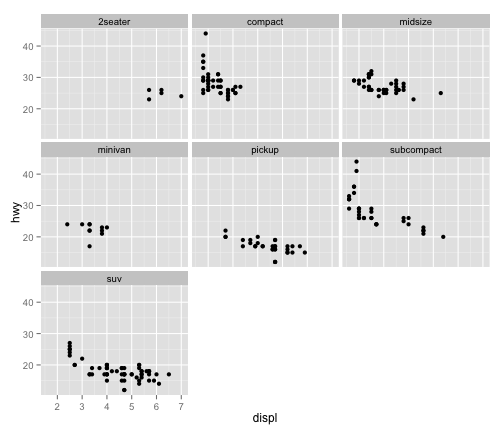

## How's the problem set?

---
## Today
1. Finishing up data objects
2. Starting with graphs

---
## Matrices
* A matrix is a two-dimensional vector
* An array is k dimensions
* Can be numeric OR string, not both

```
m1 <- matrix(c(1,2,3,4),nrow=2)
m1
m2 <- matrix(c(1,2,3,4,5,6),ncol=2)
class(m2)
str(m2)
m3 <- matrix(letters,ncol=2)
str(m3)
```

---
## Matrices
* matrices are indexed by x and y coordinates [x,y]
* Indexing matrices: 
  * mtcars
  * What value is in the 6th row, 2nd column of mtcars?
  * What values are in the 6:8th row, 2,5,7th columns
  * Why does the first work and the second not?: 
    a. letters[c(1,2)] 
    b. letters[1,2]

---
## Wiping out Teddy Roosevelt

```
library(pixmap)
mtrush2 <- read.pnm("data examples/mtrush1.pgm")
mtrush2
str(mtrush2)
plot(mtrush2)
mtrush2@grey
dim(mtrush2@grey)
```

* values are a continuum on the grey scale from 0 to 1.
* The pixels representing Teddy's face are in rows: 84:163 and in the columns: 135:177
* Can you white out Teddy?


---
## data.frames
* Type of class you'll (probably) use most
* Like a matrix, but each column can be any type of class

```
x <- 10:1
y <- -4:5
first10letters <- letters[1:10] 
df <- data.frame(x,y,first10letters)
```

* Columns have to be the same length

```
first11letters <- letters[1:11] 
data.frame(x,y,first11letters)
```

---
## The object names are the column names

```
names(df)
athroughj <- letters[1:10] 
df <- data.frame(x,y,athroughj)
names(df)
names(df) <- c("a1","a2","column3")
names(df)
```

---
## Learning about your data.frame

```
nrow(df)
ncol(df)
dim(df)
names(df)[3]
head(df)
tail(df,10)
df[1:3,3]
class(df[,3])
class(df[,1])
df$column3
df[,"column3"]
```


---
## Subsetting your data

```
newdf <- subset(df,x==1)
newdf <- df[df$x==1,]
```

* Like everything else, can have multiple logical operators

```
newdf <- subset(df,x==1|y==2)
newdf <- subset(df,(x==1|y==2) & z!=3)
```

* Can also have R just spit out the columns we want
```
subset(df,select==c("x","y"),subset=z<3)
```

---
## With the Titanic dataset in datasets package
* Using subset, what was the mean age of children?
* Using indices to filter, what was the mean age of adults?
* Get R to give you two new datasets, one with "survivor" and "name" for those only in 1st class
* Using table(): what percentage on board were 1st class, 2nd class, and 3rd class passengers
* Adding an additional variable and the prop.table command,what percentage of 1st class, 2nd class, 3rd class?
* Using a X^2 test, was the survival rate significantly different between men and women?

---
## Various functions you perform on the entire dataset (or subsets)
* colSums(), rowSums(), colMeans(), rowMeans()
* Use the USArrests dataset in the dataset package. What was the total # of violent crimes by state?
* What was the average number of each violent crime across all states?
* For states where more than 70 percent of the population lives in cities, what is the average number of attacks, by crime?

---
## Lists

```
newlist <- list(mtcars,letters,mtrush2)
newlist[[3]]
```

* Will become much more useful down the road. 
* Try the following:
  * Generate the mean score for each dataset in load("experiment_list.RData")
  * Try this lapply(experiment_list,function(x)mean(x$score))

---
## R base graphics
```
hist(mtcars$mpg)
plot(mtcars$mpg~mtcars$hp)
boxplot(mtcars$mpg,mtcars$cyl)
```

---
## R base graphics
* Generally ugly
* Enter Hadley Wickham
* 
* ggplot2: The grammar of graphics
* Easy to start with, but you can end up with complex figures. 
* Today will do part 1. In a few weeks we'll do part 2. 

---
## ggplot2

```
install.packages(ggplot2)
```

### Every ggplot2 object has three components
1. data,

2. A set of aesthetic mappings between variables in the data and visual properties, and

3. At least one geom, geometric object, which describes how to render each observation.

```
ggplot(mpg, aes(x = displ, y = hwy)) +geom_point()
```

---
## Exercises (1)
1. What is this showing? 
```
ggplot(mpg, aes(model, manufacturer)) + geom_point() 
```
2. Can you make it more informative?

3. Describe the data, aesthetic mappings and layers used for each of the following plots. See if you can predict what the plot will look like before running the code.

```
ggplot(mpg, aes(cty, hwy)) + geom_point()
ggplot(diamonds, aes(carat, price)) + geom_point()
ggplot(economics, aes(date, unemploy)) + geom_line()
ggplot(mpg, aes(cty)) + geom_histogram()
```

---
## Aesthetics

```
aes(displ, hwy, colour = class)
aes(displ, hwy, shape = drv)
aes(displ, hwy, size = cyl)
```

```
ggplot(mpg, aes(displ, cty)) + 
  geom_point()
ggplot(mpg, aes(displ, cty, colour = class)) + 
  geom_point()
ggplot(mpg, aes(displ, cty, colour = class)) +  geom_point(color="blue")
```

---
## Exercises
1. Experiment with the colour, shape and size aesthetics. What happens when you map them to continuous values? What about categorical values? 

2. What happens when you use more than one aesthetic in a plot?

3. What happens if you map a continuous variable to shape? Why? What happens if you map trans to shape? Why?

---
##
[Plot the graphs found in part 1, found here:](https://github.com/ylelkes/R_wav/blob/master/Week2-a/makethesegraphs.pdf)

---
## Facetting :Tables of graphics


```r
library(ggplot2)
ggplot(mpg, aes(displ, hwy)) + geom_point() +facet_wrap(~class)
```

 

---
## Facetting 
Make the graphs found in Part 2. Hint, need a different facet function for the second graph

---
## Building a plot layer by layer
```
p <- ggplot(mpg, aes(displ, hwy))
p
r <- p+geom_point()
r
j <- r+geom_smooth()
j
j+geom_text(aes(label=manufacturer))

---
## Saving your graphs
ggsave()

---
## Lots more customization available


