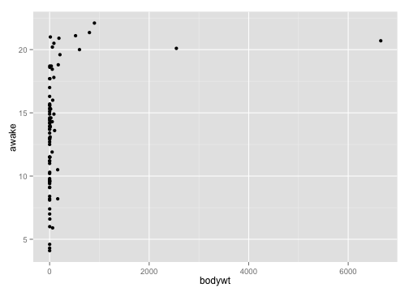
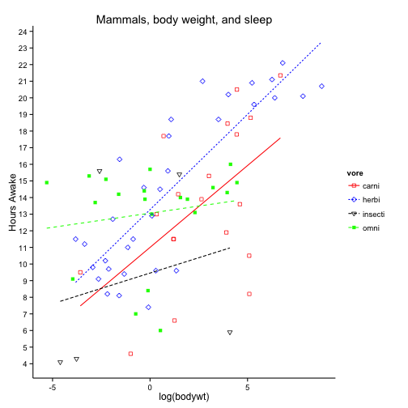

## How was the problem set?

---
## Today
1. Lists
2. Starting with graphs
3. You'll need to follow along on the slides posted here: https://github.com/ylelkes/R_wav

---
## Various functions you perform on the entire dataset (or subsets)
* colSums(), rowSums(), colMeans(), rowMeans()
* Use the USArrests dataset in the datasets package data(datasets::USArrests). 
* What was the total # of violent crimes by state?
* What was the average number of each violent crime across all states?
* For states where more than 70 percent of the population lives in cities, what is the average number of attacks, by crime?

---
* What was the total # of violent crimes by state?

```r
head(rowSums(USArrests[,c(1,2,4)]))
```

```
##    Alabama     Alaska    Arizona   Arkansas California   Colorado 
##      270.4      317.5      333.1      218.3      325.6      250.6
```

* What was the average number of each violent crime across all states?

```r
colMeans(USArrests[,c(1,2,4)])
```

```
##  Murder Assault    Rape 
##   7.788 170.760  21.232
```

---

* For states where more than 70 percent of the population lives in cities, what is the average number of attacks, by crime?


```r
colMeans(subset(USArrests,USArrests$UrbanPop>70)[,c(1,2,4)])
```

```
##     Murder    Assault       Rape 
##   7.863158 194.052632  24.989474
```


---
## Lists

* A list is a type of object that can hold any other object
```
newlist <- list(mtcars,letters,6)
newlist[[2]]
```
* Index or subset within a list
```
newlist[[1]][,6]
```
* Will become much more useful down the road. 

---
* Try the following:
  * Run the following code:
  
  <sub>
  ```
 listexample <-  
 list(experiment1=data.frame(condition=c("Control","Treat"),score=rnorm(100)),
 experiment2=data.frame(condition=c("Control","Treat"),score=rnorm(100)),
 experiment3=data.frame(condition=c("Control","Treat"),score=rnorm(100)))
  ```
  </sub>
  
  * Generate the mean score for Treatment and Control for each dataset
  * When you're done try the following:
  
  ```
lapply(listexample,function(x)c(Treatment=mean(subset(x,condition=="Treat")$score),
Control=mean(subset(x,condition=="Control")$score)))
    ```

---
## R base graphics
```
hist(mtcars$mpg)
plot(mtcars$mpg~mtcars$hp)
boxplot(mtcars$mpg,mtcars$cyl)
```

---
## R base graphics
* Generally ugly
* Enter Hadley Wickham
* 
* ggplot2: The grammar of graphics
* Easy to start with, but you can end up with complex figures. 
* Today will do part 1. In a few weeks we'll do part 2. 

---
## ggplot2

```
install.packages(ggplot2)
```

### Every ggplot2 object has three components
1. data,

2. A set of aesthetic mappings between variables in the data and visual properties, and

3. At least one geom, geometric object (or later), which describes how to render each observation.

```
library(ggplot2)
ggplot(mpg, aes(x = displ, y = hwy)) +geom_point()
```

---
## Exercises (1)
1. What is this showing? 
```
ggplot(mpg, aes(model, manufacturer)) + geom_point() 
```
2. Can you make it more informative?

3. Describe the data, aesthetic mappings and layers used for each of the following plots. See if you can predict what the plot will look like before running the code.

```
ggplot(mpg, aes(cty, hwy)) + geom_point()
ggplot(diamonds, aes(carat, price)) + geom_point()
ggplot(economics, aes(date, unemploy)) + geom_line()
ggplot(mpg, aes(cty)) + geom_histogram()
```

---
## Aesthetics

```
aes(displ, hwy, colour = class)
aes(displ, hwy, shape = drv)
aes(displ, hwy, size = cyl)
```

```
ggplot(mpg, aes(displ, cty)) + 
  geom_point()
ggplot(mpg, aes(displ, cty, colour = class)) + 
  geom_point()
ggplot(mpg, aes(displ, cty)) +  geom_point(color="blue")
```

---
## Exercises
1. Experiment with the colour, shape and size aesthetics. What happens when you map them to continuous values? What about categorical values? 

2. What happens when you use more than one aesthetic in a plot?

3. What happens if you map a continuous variable to shape? Why? What happens if you map trans to shape? Why?

---
##
[Plot the graphs found in part 1, found here:](https://github.com/ylelkes/R_wav/blob/master/Week2-a/makethesegraphs.pdf)
* If you finish early, start exploring ggplot--change the x-axis, rotate labels, label scales, change the x-y limits, check out themes (e.g., theme_bw)

---
## Saving your graphs
* ggsave(filename="x.pdf",width=8,height=8)

* ggsave(filename="x.png",width=8,height=8)

* etc


---
## Facetting :Tables of graphics


```r
library(ggplot2)
ggplot(mpg, aes(displ, hwy)) + geom_point() +facet_wrap(~class)
```

 

---
## Facetting 
Make the graphs found in Part 2. Hint, need a different facet function for the second graph


---
## Plotting errors

* In most plots, we want to display uncertainty
* Here need to display a xmin and xmax OR a ymin and a ymax within the geom

 

* Work on part 3 in the graphs section.

---
## Building a plot layer by layer

```
p <- ggplot(as.data.frame(state.x77), aes(Illiteracy, Murder))
p
r <- p+geom_point()
r
j <- r+geom_smooth(method="lm")
j
j+geom_text(aes(label=rownames(as.data.frame(state.x77))))
```

---
## Annotate your graphics


```r
library(devtools)
source_gist("524eade46135f6348140")
library(ggplot2)
state.x77 <- as.data.frame(state.x77)
p1 <- ggplot(data = state.x77, aes(x = Illiteracy, y = Murder, label=Murder)) +
  stat_smooth_func(geom="text",method="lm",hjust=0,parse=TRUE) +
  geom_smooth(method="lm",se=FALSE) +
  geom_point() 
```

---

```r
p1
```

 

---
## Try this:
1. Write code to figure out the state with the highest murder rate (not just by looking at the matrix), hint
2. using the annotate command and ggplot, create a scatterplot and label that point with the state's name.

---
##

```r
murderhi <- as.data.frame(state.x77)[as.data.frame(state.x77)$Murder==max(as.data.frame(state.x77)$Murder),]
ggplot(data = state.x77, aes(x = Illiteracy, y = Murder, label=Murder)) +
  geom_smooth(method="lm",se=FALSE) + 
  geom_point()+annotate("text", label = rownames(murderhi),
  y = murderhi$Murder, x = murderhi$Illiteracy, size = 5,
colour = "red")+geom_point()
```


---
## Scales

* Scales control the mapping from data to aesthetics. They take your data and turn it into something that you can see, like size, colour, position or shape. 


```r
ggplot(msleep, aes(bodywt,awake)) + geom_point()
```

 

---

```r
ggplot(msleep, aes(log(bodywt),awake)) + geom_point()+xlab("Body Weight (logged)")+scale_y_continuous(breaks=seq(0,25,by=1),"Hours Awake")
```

 

---

```r
 ggplot(msleep, aes(log(bodywt),awake,colour=vore,shape=vore,lty=vore)) + geom_point()+scale_y_continuous(breaks=seq(0,25,by=1),"Hours Awake")+scale_color_manual(values=c("red","blue","black","green"))+scale_shape_manual(values = c(0, 5, 6, 15))+theme_classic()+ggtitle("Mammals, body weight, and sleep")+geom_smooth(method="lm",se=F)
```

```
## Warning: Removed 7 rows containing missing values (geom_point).
```

 

---
## Starting to reshape data

* Enter Hadley Wickham again


```r
widedata <- data.frame(RID=1:100,T1=rnorm(100),T2=rnorm(100),T3=rnorm(100),gender=c("Male","Female"))
head(widedata)
```

```
##   RID         T1         T2         T3 gender
## 1   1 -0.2233425  1.3978480  2.0581137   Male
## 2   2 -0.9860396 -1.7519849  1.9697835 Female
## 3   3 -0.8443850  0.2926781 -0.1614779   Male
## 4   4  0.7535063 -1.3679396 -2.1342240 Female
## 5   5  1.8617856 -0.6797770 -0.5867648   Male
## 6   6  1.2359535 -0.5283758 -1.0879701 Female
```

```r
library(reshape2)
longdata <- melt(widedata,id.vars = c("RID","gender"),measure.vars = c("T1","T2","T3"))
head(longdata[order(longdata$RID),])
```

```
##     RID gender variable      value
## 1     1   Male       T1 -0.2233425
## 101   1   Male       T2  1.3978480
## 201   1   Male       T3  2.0581137
## 2     2 Female       T1 -0.9860396
## 102   2 Female       T2 -1.7519849
## 202   2 Female       T3  1.9697835
```

* Melt the asylum data into long form. Create a time series plot where you choose a subset of refugees from 4-5 countries and track their flows over the 4 quarters. Use scales to set the linetypes and colors. 
* Try the directlabels package (geom_dl) and label the endpoints with the country of origin of each country. 


