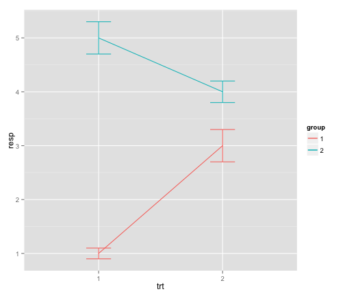

## How was the problem set?

---
## Today
1. Lists
2. Starting with graphs

---
## Various functions you perform on the entire dataset (or subsets)
* colSums(), rowSums(), colMeans(), rowMeans()
* Use the USArrests dataset in the datasets package (data(datasets::USArrests). 
* What was the total # of violent crimes by state?
* What was the average number of each violent crime across all states?
* For states where more than 70 percent of the population lives in cities, what is the average number of attacks, by crime?

---
* What was the total # of violent crimes by state?

```r
head(rowSums(USArrests[,c(1,2,4)]))
```

```
##    Alabama     Alaska    Arizona   Arkansas California   Colorado 
##      270.4      317.5      333.1      218.3      325.6      250.6
```

* What was the average number of each violent crime across all states?

```r
colMeans(USArrests[,c(1,2,4)])
```

```
##  Murder Assault    Rape 
##   7.788 170.760  21.232
```

---

* For states where more than 70 percent of the population lives in cities, what is the average number of attacks, by crime?


```r
colMeans(subset(USArrests,USArrests$UrbanPop>70)[,c(1,2,4)])
```

```
##     Murder    Assault       Rape 
##   7.863158 194.052632  24.989474
```


---
## Lists

* A list is a type of object that can hold any other object
```
newlist <- list(mtcars,letters,6)
newlist[[2]]
```
* Index or subset within a list
```
newlist[[1]][,6]
```
* Will become much more useful down the road. 

---
* Try the following:
  * Run the following code:
  
  <sub>
  ```
 listexample <-  
 list(experiment1=data.frame(condition=c("Control","Treat"),score=rnorm(100)),
 experiment2=data.frame(condition=c("Control","Treat"),score=rnorm(100)),
 experiment3=data.frame(condition=c("Control","Treat"),score=rnorm(100)))
  ```
  </sub>
  
  * Generate the mean score for each dataset
  * When you're done try the following:
  
  ```
lapply(listexample,function(x)c(Treatment=mean(subset(x,condition=="Treat")$score),
Control=mean(subset(x,condition=="Control")$score)))
    ```

---
## R base graphics
```
hist(mtcars$mpg)
plot(mtcars$mpg~mtcars$hp)
boxplot(mtcars$mpg,mtcars$cyl)
```

---
## R base graphics
* Generally ugly
* Enter Hadley Wickham
* 
* ggplot2: The grammar of graphics
* Easy to start with, but you can end up with complex figures. 
* Today will do part 1. In a few weeks we'll do part 2. 

---
## ggplot2

```
install.packages(ggplot2)
```

### Every ggplot2 object has three components
1. data,

2. A set of aesthetic mappings between variables in the data and visual properties, and

3. At least one geom, geometric object (or later), which describes how to render each observation.

```
library(ggplot2)
ggplot(mpg, aes(x = displ, y = hwy)) +geom_point()
```

---
## Exercises (1)
1. What is this showing? 
```
ggplot(mpg, aes(model, manufacturer)) + geom_point() 
```
2. Can you make it more informative?

3. Describe the data, aesthetic mappings and layers used for each of the following plots. See if you can predict what the plot will look like before running the code.

```
ggplot(mpg, aes(cty, hwy)) + geom_point()
ggplot(diamonds, aes(carat, price)) + geom_point()
ggplot(economics, aes(date, unemploy)) + geom_line()
ggplot(mpg, aes(cty)) + geom_histogram()
```

---
## Aesthetics

```
aes(displ, hwy, colour = class)
aes(displ, hwy, shape = drv)
aes(displ, hwy, size = cyl)
```

```
ggplot(mpg, aes(displ, cty)) + 
  geom_point()
ggplot(mpg, aes(displ, cty, colour = class)) + 
  geom_point()
ggplot(mpg, aes(displ, cty)) +  geom_point(color="blue")
```

---
## Exercises
1. Experiment with the colour, shape and size aesthetics. What happens when you map them to continuous values? What about categorical values? 

2. What happens when you use more than one aesthetic in a plot?

3. What happens if you map a continuous variable to shape? Why? What happens if you map trans to shape? Why?

---
##
[Plot the graphs found in part 1, found here:](https://github.com/ylelkes/R_wav/blob/master/Week2-a/makethesegraphs.pdf)

---
## Saving your graphs
ggsave(filename="x.pdf",width=8,height=8)
ggsave(filename="x.png",width=8,height=8)
etc


---
## Facetting :Tables of graphics


```r
library(ggplot2)
ggplot(mpg, aes(displ, hwy)) + geom_point() +facet_wrap(~class)
```

 

---
## Facetting 
Make the graphs found in Part 2. Hint, need a different facet function for the second graph


---
## Plotting errors

* In most plots, we want to display uncertainty


```r
df <- data.frame(
  trt = factor(c(1, 1, 2, 2)), 
  resp = c(1, 5, 3, 4), 
  group = factor(c(1, 2, 1, 2)), 
  se = c(0.1, 0.3, 0.3, 0.2)
)
df2 <- df[c(1,3),]

# Define the top and bottom of the errorbars
limits <- aes(ymax = resp + se, ymin=resp - se)

p <- ggplot(df, aes(fill=group, y=resp, x=trt))
p + geom_bar(position="dodge", stat="identity")
```

 

```r
# Because the bars and errorbars have different widths
# we need to specify how wide the objects we are dodging are
dodge <- position_dodge(width=0.9)
p + geom_bar(position=dodge) + geom_errorbar(limits, position=dodge, width=0.25)
```

 

```r
p <- ggplot(df, aes(colour=group, y=resp, x=trt))

# If we want to draw lines, we need to manually set the
# groups which define the lines - here the groups in the 
# original dataframe
p + geom_line(aes(group=group)) + geom_errorbar(limits, width=0.2)    
```

 

---
## Building a plot layer by layer

```
p <- ggplot(as.data.frame(state.x77), aes(Illiteracy, Murder))
p
r <- p+geom_point()
r
j <- r+geom_smooth(method="lm")
j
j+geom_text(aes(label=rownames(as.data.frame(state.x77))))
```

---
## Annotate your graphics

```
library(devtools)
source_gist("524eade46135f6348140")

p <- ggplot(as.data.frame(state.x77), aes(x=Illiteracy,y= Murder))+geom_smooth(method="lm",se=F)+geom_text(x =1, y = 10, label = lm_eqn(df), parse = TRUE)
ggplot(data = as.data.frame(state.x77), aes(x = Illiteracy, y = Murder, label=Murder)) +
  stat_smooth_func(geom="text",method="lm",hjust=0,parse=TRUE) +
  geom_smooth(method="lm",se=FALSE) +
  geom_point() 

```

---
## Lots more customization available

* Learn about colour brewer scale_colour_brewer and 
* Learn about [ggthemr](https://github.com/cttobin/ggthemr)


