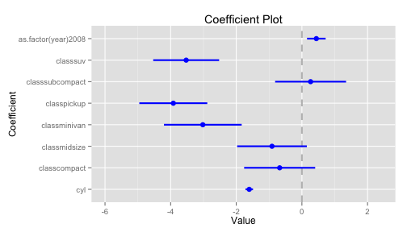
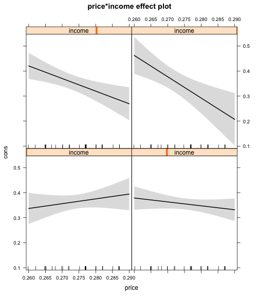
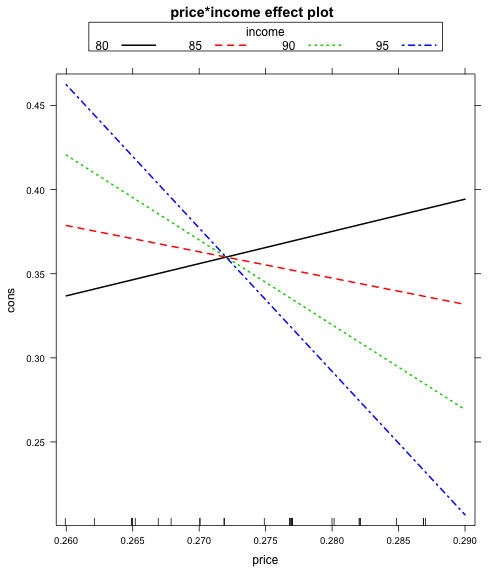

---
## Plotting coefficients 

1. How should we present our findings?
2. A move away from tables into figures.

---
## Coefficient plots

```r
library(coefplot)
reg1 <- lm(cty~cyl+class+as.factor(year),mpg)
coefplot(reg1,intercept = F)
```

---
## Coefficient plots
 

---
## Effects package

```r
library(effects)
library(Ecdat)
data(Icecream)
r1 <- lm(formula = cons ~ price * income, data = Icecream)  
eff1 <- effect(r1,term="price*income")
plot(eff1)
plot(eff1,multiline=T)
```

---
## Effects package

 

---

 

---
## Effects package
1. Create a coefplot of the effect of main effects of price and income on icecreame consumption
2. For a model with the interaction effects of price*consumption, Extract the output from effects::effect, and replot the 2 way interaction effects and 95 percent confidence intervals in ggplot, so that you can combine confidence intervals and 2 lines in 1 plot
3. Let's try three-way interactions use threeway.sav in the data folder, which is a three factorial experiment (a,b,c) on some dependent variable y. First plot it with the built in plot, but extract the output and plot it in ggplot. To make this work, you'll probably have to reshape the data so it's in long format. 


```r
load(url("http://cdn.rawgit.com/ylelkes/R_wav/master/data/threeway.RData"))
```

---
## Generating predicting values
1. A number of ways to get a predicted value (and error)
2. predict(), effects()
3. Zelig is useful b/c it can handle a bunch of different models


---
## 

```r
library(Zelig)
library(Ecdat)
z1 <- zelig(formula =cons ~ price * income, data = Icecream,model = "normal")
setz1 <- setx(z1,price=.5)
s.out <- sim(z1, x = setz1)
```

---
## 

```r
z1 <- zelig(formula =cons ~ price * income, data = Icecream,model = "normal")
setz1 <- setx(z1,price=.5,income=40:50)
s.out <- sim(z1, x = setz1)
summary(s.out)
```

---
## 

```r
library(Zelig)
library(Ecdat)
z1 <- zelig(formula =cons ~ price * income, data = Icecream,model = "normal")
setx1 <- setx(z1,price=.5)
setx2 <- setx(z1,price=.75)
s.out <- sim(z1, x =  setx1,x1 = setx2)
summary(s.out)
```


---
## Exercises

1. Download the following data, which looks at the relationship between cancer remssion and a variety of variables

```r
hdp <- read.csv("http://www.ats.ucla.edu/stat/data/hdp.csv")
```
2.  Using a logit model, regress remission on a variety of variables, including age and smoking habits. 
3. Calculate predicted probabilites of remission for the youngest and oldest people in the dataset who are current smokers, former smokers, and never smokers, respectively. 
4. Extract and plot the predicted probabilities and 95 percent confidence intervals. 

---
## Writing functions
1. Sometimes we find ourselves rewriting code over and over again. 
2. We can use functions to make plyr and other packages do what we want. 

---
##  for instance:

```r
square.it <- function(x) {
    square <- x * x
    return(square)
}
```

---
## 
  

```r
square.it(6)
```

```
## [1] 36
```

---


```r
xy <- function(x,y) {
    xy <- x * y
    return(xy)
}
```
---
## 
  

```r
xy(6,4)
```

```
## [1] 24
```

---

* One function I use all the time  recodes all the values in a vector to lie between 0 and 1, where 0 indicates the lowest score in that vector, 1 indicates the highest. To calculate this, we substract the minimum of the vector X from X and divide that score  by the maximimum score of X minus the minimum of X. Write a zero1 function and apply it to mtcars$disp and mtcars$cyl. 

---
* Dplyr works with user-defined functions. The input into a function need not be a vector or a number, but it can also be a dataframe. Remember that dplyr pushes an object forward. 
* With the ToothGrowth data, write a function that takes a dataset (x), and regresses length (len) on dose, and keeps the estimate and standard error for the dose coefficient.
* Stick that function into dplyr so that you get different output based on supplement type, and plot the coefficients and 95 percent confidence intervals.
  
---
1. Let's create a list of 10 dataframes with x and y in each:


```r
sim_list = replicate(n = 10,                  
expr = {data.frame(x = rnorm(50), y = rnorm(50), z=rnorm(10))}, simplify = F)
```
2. Write a function, that, given a dataframe regresses y on x and z (y=x+z).
3. Input that function and dataframe into lapply(), which performs a function on each element in a list. The result will be a list of regressions.  
4. Put the output into stargazer,screenreg, or another regression to table function, so you have a regression table that is 10 columns long.    
