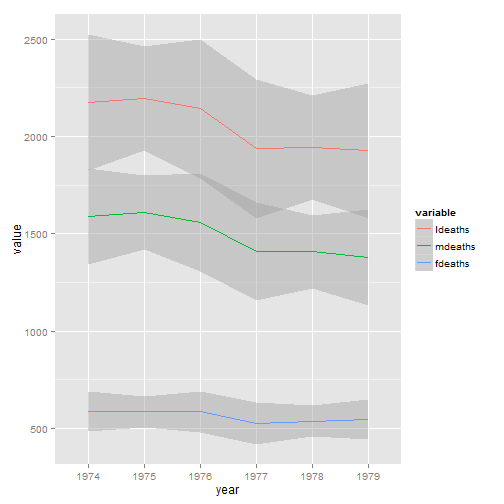

---
## Getting data into shape

1. Ran 10 experiments, now want to do a meta-analysis. 
2. I want to match my country level data with my individual-level data.
3. I have time series data that looks like this:


```
##   Code     Country  X1950  X1951  X1952  X1953  X1954
## 1  AFG Afghanistan 20,249 21,352 22,532 23,557 24,555
## 2  ALB     Albania  8,097  8,986 10,058 11,123 12,246
```

---
## I want it to look like this:


```
##   Code     Country variable  value
## 1  AFG Afghanistan    X1950 20,249
## 2  ALB     Albania    X1950  8,097
## 3  AFG Afghanistan    X1951 21,352
## 4  ALB     Albania    X1951  8,986
## 5  AFG Afghanistan    X1952 22,532
## 6  ALB     Albania    X1952 10,058
```

---
## Stacking dataframes with rbind

1. Try the following:
```
load(url("https://cdn.rawgit.com/ylelkes/R_wav/master/data/rbindexercises.RData"))
```

2. First, use colnames to look at the names of df1,df2,df3.
3. use rbind to stack df1, df2, and df3 into one dataframe. 
4. Now try to add df4 to the stacked dataframe. How do we fix it?
5. Now add df5. Doesn't work? Try plyr::rbind.fill
6. What does the variables third and fourth look like for the df1:df4?

---
## Merging dataframes

1. Merging in R is *usually* pretty simple with the merge command. 
2. Example from R

---
## Exercise
1. Let's start with merging two dataframes
3. You always need a key that links data.frames, individual, country, etc.
3. Merge the US state characteristic files state.x77 with this, with the variable Obamafeelings indicating a score on a feeling thermometer from 0=cold to 100=hot 
```
load(url("https://cdn.rawgit.com/ylelkes/R_wav/master/data/anes.RData"))
```
4. Hint: state.x77 needs to be converted to a dataframe
5. What state characteristics predict liking Obama?

---
## Sometimes you want to merge based on multiple keys

1. See what happens, and what your answers look like if you merge two of the datasets in the following file, first by country.name only, then by program.name only, then by both country.name and program.name. Note the dimensions, number of variables. 

```
load(url("https://rawgit.com/ylelkes/R_wav/master/data/foreignaid.RData"))
```

---
## Sometimes we want to merge more than two datasets.

1. Use the following function to merge all the Aid datasets: `reshape::merge_all`
2. Note, there are other ways of merging data. With really big datasets (N=millions), we probably want to use data.table or plyr.  

---
## Reshaping data


---
## What makes data wide or long?


```
##    ldeaths mdeaths fdeaths month year
## 1:    3035    2134     901   Jan 1974
## 2:    2552    1863     689   Feb 1974
## 3:    2704    1877     827   Mar 1974
## 4:    2554    1877     677   Apr 1974
## 5:    2014    1492     522   May 1974
## 6:    1655    1249     406   Jun 1974
```

---
## What makes data wide or long?

```
##      month year variable value
##   1:   Jan 1974  ldeaths  3035
##   2:   Feb 1974  ldeaths  2552
##   3:   Mar 1974  ldeaths  2704
##   4:   Apr 1974  ldeaths  2554
##   5:   May 1974  ldeaths  2014
##  ---                          
## 212:   Feb 1979  fdeaths   379
## 213:   Mar 1979  fdeaths   393
## 214:   Apr 1979  fdeaths   411
## 215:   May 1979  fdeaths   487
## 216:   Jun 1979  fdeaths   574
```

---
## Why is this useful?

---
## Why is this useful?

```r
library(dplyr)
meltedlungs %>% group_by(year) %>% summarise(average=mean(value),sd=sd(value),N=n())
```

```
## Source: local data table [6 x 4]
## 
##   year  average       sd  N
## 1 1974 1452.222 750.0330 36
## 2 1975 1450.056 796.4717 36
## 3 1976 1428.778 876.3478 36
## 4 1977 1290.500 707.7449 36
## 5 1978 1330.611 747.4531 36
## 6 1979 1274.333 700.9802 36
```

---
## Why is this useful?

```r
library(dplyr)
meltedlungs %>% group_by(year,variable) %>% summarise(average=mean(value),sd=sd(value),N=n())
```

```
## Source: local data table [18 x 5]
## Groups: year
## 
##    year variable   average       sd  N
## 1  1974  ldeaths 2178.3333 494.5983 12
## 2  1975  ldeaths 2175.0833 602.2528 12
## 3  1976  ldeaths 2143.1667 831.8715 12
## 4  1977  ldeaths 1935.7500 552.0763 12
## 5  1978  ldeaths 1995.9167 621.5696 12
## 6  1979  ldeaths 1911.5000 572.2454 12
## 7  1974  mdeaths 1589.2500 328.7890 12
## 8  1975  mdeaths 1603.9167 427.5011 12
## 9  1976  mdeaths 1558.0833 579.8723 12
## 10 1977  mdeaths 1410.5833 391.8700 12
## 11 1978  mdeaths 1444.0833 451.1524 12
## 12 1979  mdeaths 1369.7500 414.8553 12
## 13 1974  fdeaths  589.0833 169.7412 12
## 14 1975  fdeaths  571.1667 176.1502 12
## 15 1976  fdeaths  585.0833 252.6066 12
## 16 1977  fdeaths  525.1667 162.8479 12
## 17 1978  fdeaths  551.8333 170.8869 12
## 18 1979  fdeaths  541.7500 160.0080 12
```

## Why is this useful?

```r
library(ggplot2)
```

```
## Warning: package 'ggplot2' was built under R version 3.2.2
```

```r
ggplot(meltedlungs,aes(x=year,y=value,group=variable,colour=variable))+geom_smooth() 
```

```
## geom_smooth: method="auto" and size of largest group is <1000, so using loess. Use 'method = x' to change the smoothing method.
```

 

---
## reshape2 package
* Reshape2 is based on two functions
* melt takes wide-format data and melts it into long-format data.
* cast takes long-format data and casts it into wide-format data.

---
## melting data


```r
melt(UKLung,id.vars=c("month","year"))
```

```
##      month year variable value
##   1:   Jan 1974  ldeaths  3035
##   2:   Feb 1974  ldeaths  2552
##   3:   Mar 1974  ldeaths  2704
##   4:   Apr 1974  ldeaths  2554
##   5:   May 1974  ldeaths  2014
##  ---                          
## 212:   Feb 1979  fdeaths   379
## 213:   Mar 1979  fdeaths   393
## 214:   Apr 1979  fdeaths   411
## 215:   May 1979  fdeaths   487
## 216:   Jun 1979  fdeaths   574
```

---
## melting data


```r
meltedlungs <- melt(UKLung,id.vars=c("month","year"),
                    variable.name = "Gender",value.name = "Deaths")
meltedlungs
```

```
##      month year  Gender Deaths
##   1:   Jan 1974 ldeaths   3035
##   2:   Feb 1974 ldeaths   2552
##   3:   Mar 1974 ldeaths   2704
##   4:   Apr 1974 ldeaths   2554
##   5:   May 1974 ldeaths   2014
##  ---                          
## 212:   Feb 1979 fdeaths    379
## 213:   Mar 1979 fdeaths    393
## 214:   Apr 1979 fdeaths    411
## 215:   May 1979 fdeaths    487
## 216:   Jun 1979 fdeaths    574
```

---
## Getting data from long to wide


```r
head(dcast(meltedlungs,year+month~Gender,value.var = "Deaths",fun.aggregate=mean,na.rm=T))
```

```
##   year month ldeaths mdeaths fdeaths
## 1 1974   Jan  2773.5    1990   783.5
## 2 1974   Feb  2552.0    1863   689.0
## 3 1974   Mar  2704.0    1877   827.0
## 4 1974   Apr  2554.0    1877   677.0
## 5 1974   May  2014.0    1492   522.0
## 6 1974   Jun  1655.0    1249   406.0
```

---
## Exercises 
1. Melt the `airquality` data into long form, so that each of the measurements are in one column.
2. create a ggplot that tracks each measurement in a different facet.
3. cast the new data frame so you get yearly measurements in wide format.
